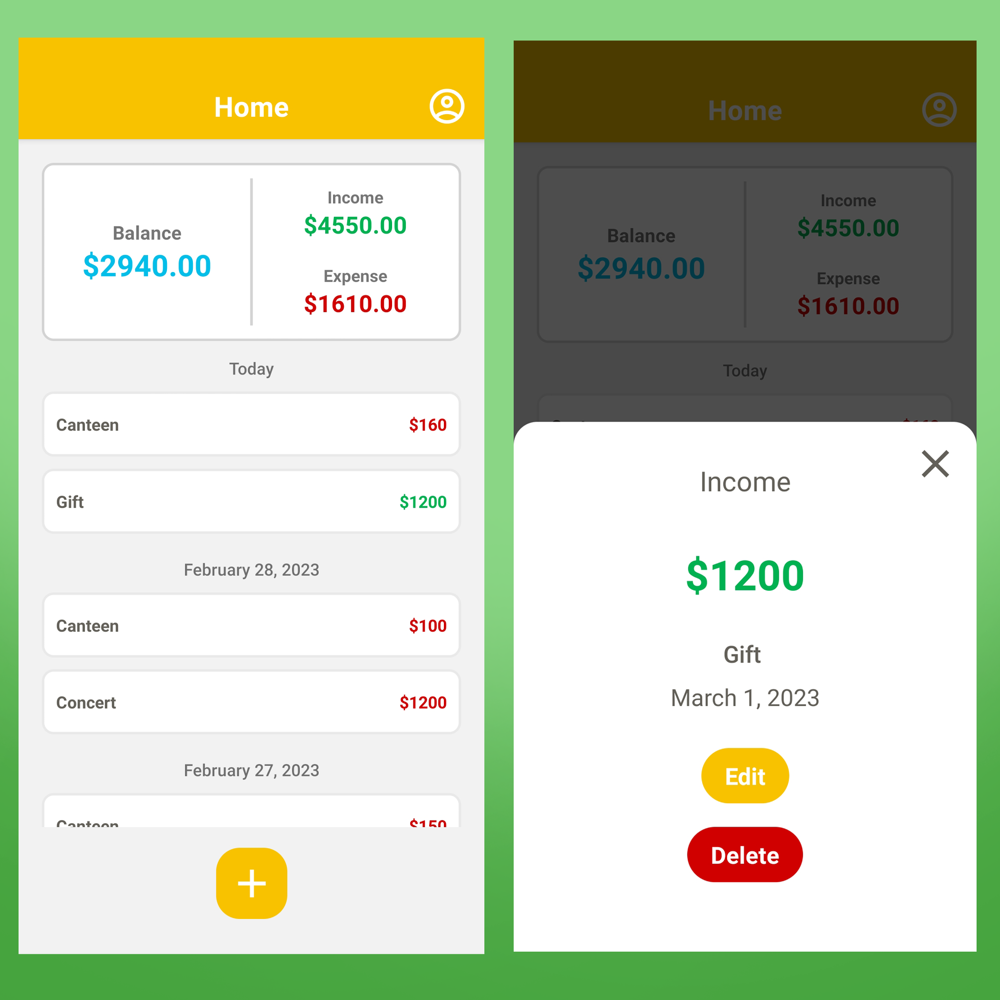
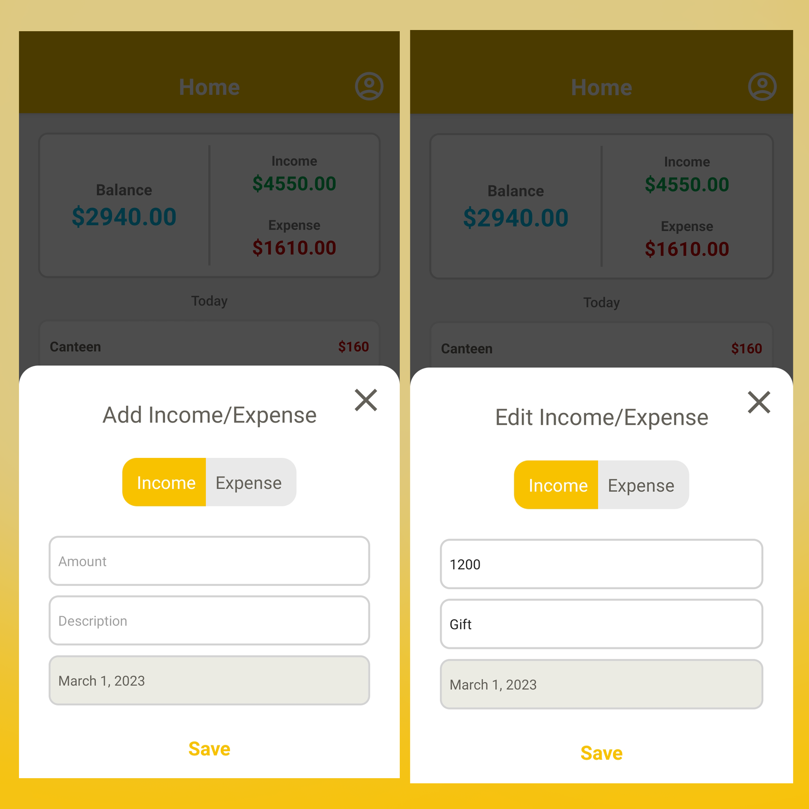
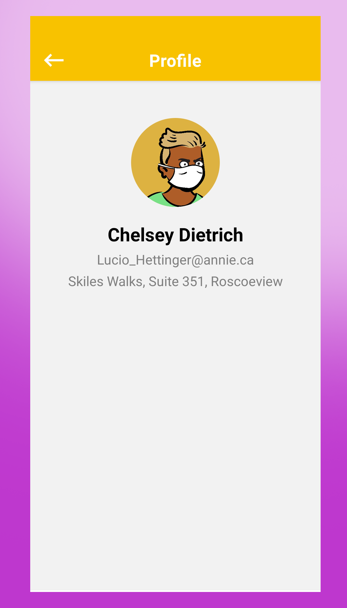

  

# 📈 Trackit 

Trackit is a React Native expense tracker app that helps you keep track of your income and expenses. The app displays your total balance, total income, and total expense on the home screen. You can also view a list of all your income and expense entries sorted by date, and edit or delete any entry as needed. In addition, the app allows you to add new income or expense entries and persistently stores them.

## 🚀 Getting started

To get started with Trackit, you'll need to have React Native installed on your machine. You can follow the [official React Native documentation](https://reactnative.dev/docs/environment-setup) to set up your development environment.

Once you have React Native set up, you can clone this repository and install the required dependencies by running:

`npm install`

You can then start the app on your preferred platform by running:

`npm run ios`

or

`npm run android`

depending on whether you want to run the app on an iOS or Android simulator.

## 🎉 Features

Trackit currently includes the following features:

- Home screen with total balance, total income, and total expense 💰
- List of all income and expense entries sorted by date 📜
- Ability to edit or delete an entry on click ✏️🗑️
- Ability to add new income or expense entries ➕
- Persistent storage of added entries 💾
- Profile screen with user profile data retrieved from an API 🧑‍💼

## 📷 Previews

  
  
  

## 🤝 Contributing

If you find a bug or would like to suggest an improvement, feel free to open an issue or submit a pull request. All contributions are welcome! 🙌

## 📄 License

Trackit is released under the [MIT License](https://opensource.org/licenses/MIT). Feel free to use and modify the code as you see fit. 📝
